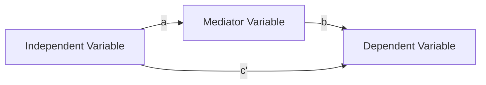

# Mediation Analyses

The goal of mediation analysis is to see if a third variable (a mediator) affects the relationship between the independent and the dependent variable.

   Total Effect Model:


  Mediation Model:



Here is the 4-step mediation analysis by Baron & Kenny (1986). 

1. Estimate the total effect between the independent variable & dependent variable
   
   Path “c” must be significantly different from 0 

2. Estimate the relationship between the independent variable on the mediator
   
   Path “a” must be significantly different from 0 

4. Estimate the relationship between the mediator on the dependent variable controlling for the independent variable
   
   Path “b” must be significantly different from 0 

6. Estimate the relationship between the independent variable on the dependent variable controlling for the mediator
   
**Full mediation**: If the relationship between IV on DV is not significant in the mediation model (path “c'” is not significantly different  from 0), MV fully mediates between IV and DV.

**Partial mediation**:  If the relationship between IV on DV is still significant in the mediation model (path “c'” is significantly different from 0), but in a smaller magnitude, MV partially mediates between IV and DV.


## SPSS


## R

```
library(mediation) #Mediation package

fit.totaleffect <- lm(DV ~ IV, data = MyData) #for linear regression
fit.totaleffect <- glm(DV ~ IV, data = MyData, family = binomial()) # for logistic regression
summary(fit.totaleffect) 

fit.mediator=lm(MV ~ IV, data = MyData)
summary(fit.mediator)

fit.dv = lm(DV ~ MV + IV, data = MyData)
summary(fit.dv)

results = mediate(fit.mediator, fit.dv, treat='IV', mediator='MV', boot=T)
summary(results)
```


## STATA
