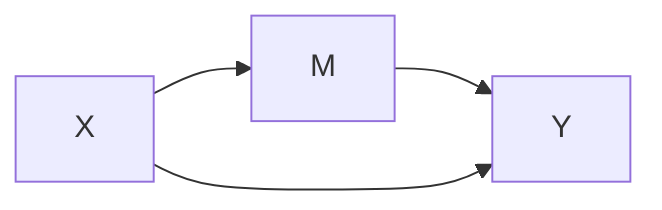

# Mediation Analyses




## SPSS


## R

```
fit.totaleffect <- lm(Y ~ X, data = mydata) #for linear regression
fit.totaleffect <- glm(Y ~ X, data = mydata, family = binomial()) # for logistic regression
summary(fit.totaleffect) 

fit.mediator=lm(M ~ X, data = mydata)
summary(fit.mediator)

fit.dv = lm(Y ~ M + X, data = mydata)
summary(fit.dv)

results = mediate(fit.mediator, fit.dv, treat='x', mediator='m', boot=T)
summary(results)
```


## STATA
