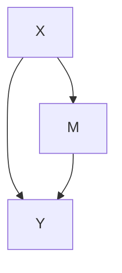

# Mediation Analyses




## SPSS


## R

```
fit.totaleffect <- lm(y ~ x, data = dataframe) #for linear regression
fit.totaleffect <- glm(y ~ x, data = dataframe, family = binomial()) # for logistic regression
summary(fit.totaleffect) 

fit.mediator=lm(m~x, data = dataframe)
summary(fit.mediator)

fit.dv = glm(y ~ m + x, data = dataframe, family = binomial())
summary(fit.dv)

results = mediate(fit.mediator, fit.dv, treat='x', mediator='m', boot=T)
summary(results)
```


## STATA
